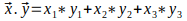

# u23t1: Ejercicios con Cadenas, Listas y Funciones

## Ejercicio 1: Cálculo del Módulo de un Vector en 

1. Defina una función llamada `calcular_norma(x, y, z)` que recibe las coordenadas `x` e `y` y `z` del vector para calcular la norma del vector en . La función debe calcular y retornar la norma del vector usando la siguiente fórmula:

   

2. Escribe un programa principal que realice lo siguiente:

   - Solicite al usuario las coordenadas `x` e `y` del vector, como se muestra (en una sola línea):
      ```
      Ingrese las coordenadas x, y del vector: 25 100
      ```
      No use `split()`, use `find()` y slicing para obtener los valores de `x` e `y`.

   - Invoque la función para calcular el módulo de tres vectores `v1`, `v2` y `v3` para las coordenadas ingresadas por el usuario y los valores de `z` que se muestran a continuación:   
      - `z = 3`
      - `z = 30`
      - `z = 100`

   - Finalmente, muestre el resultado de la norma de los 3 vectores con dos dígitos en la parte decimal, como se muestra:
      ```
      El módulo del vector en el plano z=3 es ##.##
      El módulo del vector en el plano z=30 es ##.##
      El módulo del vector en el plano z=100 es ##.##
      ```

## Ejercicio 2

Escriba una función llamada `cambiar_frase(frase, caracter)` que recibe dos cadenas como argumentos. La primera cadena representa a la `frase` que se va a modificar y la segunda cadena es el `caracter` de reemplazo. La función debe retornar la frase modificada de tal manera que, dada la primera letra de la `frase` cambiar todas las ocurrencias siguientes de esta por el `caracter` de reemplazo. Ejemplos de la llamada a la función: 

```
cambiar_frase("babero bonito", "+") -> "ba+ero +onito"
cambiar_frase("coca cola", "#") -> "co#a #ola"
cambiar_frase("ardilla", "$") -> "ardill$"
```

## Ejercicio 3

Escriba una función `mezclar_palabras(a, b)` que recibe dos cadenas `a` y `b`. Esta función debe retornar una nueva cadena que resulte de concatenar a y b en ese orden, separadas por un espacio. Además, los dos primeros caracteres de cada cadena deben ser intercambiados antes de la concatenación. A continuación se muestran ejemplos de la llamada a la función:

```
mezclar_palabras("mix", "pod") -> "pox mid"
mezclar_palabras("dog", "dinner") -> "dig donner"
```

## Ejercicio 4

Escriba una función `long_max(lista)` que recibe una `lista` de 3 cadenas. La función debe retornar la longitud de la cadena más larga. Pista: use las funciones de las cadenas y no utilice lazos de repetición.
```
long_max(["novia", "telemaco", "penelope"]) -> 8
long_max(["tesista", "calamitoso", "pesadez"]) -> 10
long_max(["magallanes", "villafuerte", "zambrano"]) -> 11 
```

## Ejercicio 5

Escriba una función `producto_escalar(v1, v2)` que recibe dos listas. Cada lista tiene 3 enteros y representa a un vector en `R3(x, y, z)`. 

La función debe retornar el resultado del producto escalar entre los dos vectores. Use la siguiente fórmula:



Ejemplo de la llamada a la función:

```
producto_escalar([1, 4, -1], [-1, 6, 3]) -> 20
producto_escalar([3, -3, -2], [2, 4, 0]) -> -6
```