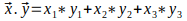

# u2: Ejercicios con con Cadenas, Listas y Funciones

## Ejercicio 1

Escriba una función llamada `cambiar_frase(frase, caracter)` que recibe dos cadenas como argumentos. La primera cadena representa a la `frase` que se va a modificar y la segunda cadena es el `caracter` de reemplazo. La función debe retornar la frase modificada de tal manera que, a partir de la primera letra de la `frase` todas las ocurrencias siguientes de esta letra se sustituyan por el `caracter` de reemplazo. Ejemplos de la llamada a la función: 

```
cambiar_frase("babero bonito", "+") -> "ba+ero +onito"
cambiar_frase("coca cola", "#") -> "co#a #ola"
cambiar_frase("ardilla", "$") -> "ardill$"
```

## Ejercicio 2

Escriba una función `mezclar_palabras(a, b)` que recibe dos cadenas `a` y `b`. La función debe devolver una nueva cadena en la que se concatenen `a` y `b`, separadas por un espacio, pero intercambiando los primeros caracteres de cada cadena. A continuación se muestran ejemplos de la llamada a la función:

```
mezclar_palabras("mix", "pod") -> "pox mid"
mezclar_palabras("dog", "dinner") -> "dig donner"
```

## Ejercicio 3

Escriba una función `long_max(lista)` que recibe una `lista` de 3 cadenas. La función debe retornar la longitud de la cadena más larga. Pista: use las funciones de las cadenas y no utilice lazos de repetición.
```
long_max(["novia", "telemaco", "penelope"]) -> 6
long_max(["tesista", "calamitoso", "pesadez") -> 10
long_max(["magallanes", "villafuerte", "zambrano"]) -> 11 
```

## Ejercicio 4

Escriba una función `producto_escalar(v1, v2)` que recibe dos listas. Cada lista tiene 3 enteros y representa a un vector en `R3(x, y, z)`. 

La función debe retornar el resultado del producto escalar entre los dos vectores. Use la siguiente fórmula:



Ejemplo de la llamada a la función:

```
producto_escalar([1, 4, -1], [-1, 6, 3]) -> 20
producto_escalar([3, -3, -2], [2, 4, 0]) -> -6
```